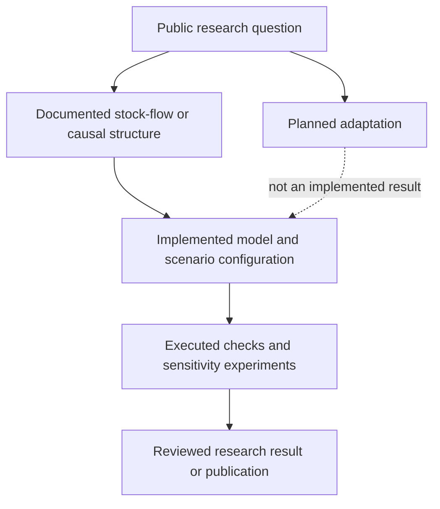

# System Dynamics portfolio | Model status and visual navigation

This repository is a **public project catalogue**, not a claim that every listed model file or dataset has been released. The existing [portfolio README](../README.md) documents each research question and protected material.

## Model-to-evidence map

**This is a maturity framework, not a claim that every project has reached every stage.** Do not conflate model construction, calibration, verification, validation, peer review or a conference submission. They require distinct supporting records.

## Per-project pointers and release boundaries

| Project described in the portfolio | Public evidence / next improvement |
| --- | --- |
| Chain of Happiness | Link to [public case study](https://github.com/Aryakia/chain-of-happiness-showcase); add only consent-cleared figures from released presentations. |
| Blackout / Chasing the Light | Describe published research question, time coverage and feedbacks without releasing unpublished calibration or simulated results. |
| Distributed Water Desalination | Add a cleared conceptual regional schematic; do not treat exploratory design questions as validated performance claims. |
| Water Infrastructure Choices | Link a paper/DOI only after its proceedings version is publicly available and author-approved. |
| Energy Policy Simulator for Iran | Keep explicitly **planned / in development** until a verifiable implementation exists; attribute upstream EPS correctly. |

## Screenshot and diagram standard

No private Vensim model screenshot or unpublished result is included here. For each released model, use a permitted high-resolution causal/stock-flow diagram with legible units; clearly mark hypothetical scenario curves as simulation outputs. Do not upload raw working models or proprietary datasets merely to decorate a case study.

## Suggested GitHub About fields (not applied)

- **Description:** `Selected System Dynamics research in energy, water, infrastructure and social systems; model status and public outputs.`
- **Topics:** `system-dynamics`, `simulation`, `energy-systems`, `water-infrastructure`, `research-portfolio`
- **Homepage:** no dedicated public site verified for this aggregate catalogue.

The central catalogue is a navigation aid only; each project retains its own repository and authorship.