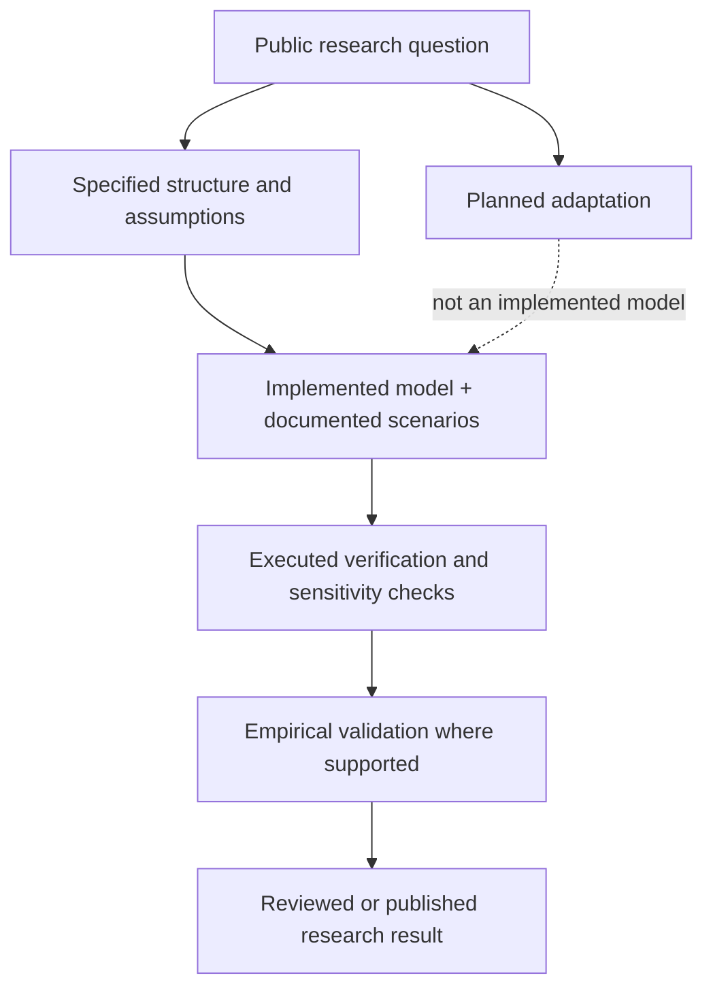

# System Dynamics portfolio | Model status and visual navigation

This is a **public research catalogue**, not a release of all model code or evidence that every model has been independently calibrated, verified or validated. Each entry remains its own project. Start with the [portfolio README](../README.md).

## Maturity is not one checkbox

The arrows show **possible research stages, not completed steps for every project**. A conference presentation or accepted abstract is not evidence of calibration, predictive validity or code reproducibility. A proposed scenario is not an executed simulation.

## Project-by-project entry points

| Project | Status actually described in the public portfolio | What a public visitor can inspect here | Specific next *presentation* improvement |
| --- | --- | --- | --- |
| [Chain of Happiness](https://github.com/Aryakia/chain-of-happiness-showcase) | Model built; ISDC 2026 presentation reported in the README. | Separate project showcase and conceptual feedback diagram. | Link an author-approved public conference record and a cleared figure, if available. |
| Blackout / *Chasing the Light* | Historical calibration period 1985–2024 and projection horizon through 2035 are **described**; independent calibration evidence is not released here. | Research question, mechanisms and policy levers in the [README](../README.md). | Add a provenance-cleared conceptual CLD and explicitly identify any public simulation figures as model outputs. |
| Distributed Water Desalination | Zonal modeling questions and planned comparisons are described; no public standalone executable model is supplied here. | Regional structure and intended output measures in the README. | Add an approved three-zone conceptual diagram and distinguish scenario assumptions from verified engineering performance. |
| Water Infrastructure Choices | WSC 2026 research output and 2015–2040 simulation are described; the proceedings version is not supplied by this catalogue. | High-level zones, scenario design, strategies and metrics in the README. | Link a confirmed public conference record only when available and author-approved. |
| Energy Policy Simulator for Iran | **Planned / in development**, not implemented or validated in this public catalogue. | Research objective and policy domains only. | Link upstream EPS with accurate attribution; add model results only after a verified implementation and release review. |

These status statements reflect the [existing public README](../README.md); they are **not** claims based on running the private models. No numerical results or private calibration inputs are newly disclosed.

## A consistent per-model public panel

For any later approved figure, use this short caption structure: **Research question · model version and structural boundary · observed data versus assumptions · tested time horizon · scenario ID · output units · validation state · author/publication credit**. Do not list a numerical result without matching its scenario and research record. A model's software revision, dataset edition and experiment ID are different things.

## Screenshot and diagram standard

No private Vensim screenshots, unpublished equations or raw model results were copied. A conceptual Mermaid schematic is not a screenshot of a working model. Use a legible, approved causal/stock-flow diagram with units only where public-release rights and coauthor permissions are clear. Keep private model files separate from this catalogue.

## GitHub About fields — proposed, not applied

- **Description:** `Selected System Dynamics research in energy, water, infrastructure and social systems; model status and public outputs.`
- **Topics:** `system-dynamics`, `simulation`, `energy-systems`, `water-infrastructure`, `research-portfolio`
- **Homepage:** no dedicated public site verified for this catalogue.

This collection is a **navigation aid**, not a personal CV or a replacement for standalone project repositories.